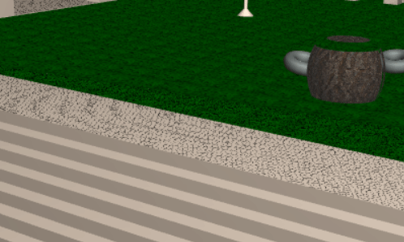

# SGI 2022/2023

## Group T01G05
| Name             | Number    | E-Mail                              |
| ---------------- | --------- | ----------------------------------- |
| Rui Alves        | 201905853 | up201905853@fe.up.pt                |
| Henrique Nunes   | 201906852 | up201906852@fe.up.pt                |

----

## Projects

### [TP1 - Scene Graph](tp1)

- Individual and documented functions for each step of the parser, where each one of them is responsible for parsing each XML tag
- Error display and warnings when missing values or properties of elements of the XML file
- All the primitives were implemented with the required vertices, faces, and normals. Also have texture implementation on those primitives, except the re-dimension of the textures coordinates on Sphere, Torus, and Cylinder.
- Implementation of inheritance of components transformations, passing the transformation matrix of a node (Ma) to the respective children nodes and applying the transformations of the children node (Mp) after the transformations of the parent (M=Ma*Mp). We also apply a transformation referenced by the transformationref tag. Reporting errors when wrong transformation specifications or invalid transformationref id property (not defined before)
- Implementation of inheritance of components materials, passing to the children material the parent material (if the material of the children is "inherit") or applying the respective material defined. Report errors when wrong material specification or invalid material id property introduced (not defined before)
- Implementation of inheritance of components texture, passing to the children texture the parent texture (if the texture of the children is inherit) or applying the respective texture (none or the texture defined, with the respective lengths). Warning in the console when no length_s or/and no length_t are introduced in texture (in that case we use length_s and length_t with value 1). 
- Verification of non-existent component references giving an error when the reference is not found
- Verification of components graph cycles giving an error when there is a cycle
- Implementation of a graphic interface with the following options:
  - display normal (shows components/objects normals)
  - display lights (shows the defined lights on the scene)
  - a folder with all the cameras, where you can select the one that you want to have your view on
  - a folder with all the lights in the scene, where you can select for each one if they are enabled or disabled
- Scene
  - The [scene](tp1/screenshots/feup.png) consists of the main [garden](tp1/screenshots/garden.png) of the FEUP Campus. This scene includes part of the corridor next to the different departments with windows and supporting columns, the bridge between building B and the others, and the [staircase](tp1/screenshots/front.png) under this bridge. The bridge is supported by circular pillars and has [rails](tp1/screenshots/rails.png) above it. In the garden are the [legacy seats](tp1/screenshots/bench.png) and some colorful [poufs](tp1/screenshots/poufs.png), as well as three [lamps](tp1/screenshots/lamp.png), one of them surrounded by an innovative [circular wood seat](tp1/screenshots/circular_bench.png). The scene also contains buildings F and G next to the corridor on the left side of the stairs and building B on the right. Building B also contains a [door](tp1/screenshots/door_off.png) with a [light](tp1/screenshots/door_on.png) on top of it, illuminating its entry. To complete the scene there is a [moon](tp1/screenshots/garden_back.png) illuminating the all scene.

-----

### [TP2 - Nurbs, Shaders and Animations](tp2)
- Better files organization (organize files (parsers, components and primitives, shaders, ..) in directories; parsers extracted to classes in separated files)
- The feature to add nurbs to the scene was implemented and some nurbs were added to the xml file
  - Rectangle (replace previous garden rectangle by a nurb rectangle)
    - Can visualize it by turning the garden lights on   
  - Tent (it was placed a tent in the garden next to the circular bench)   
  - Barrel and Circle (it was placed a barrel and its tops next to the poufs)   
  - Tent Inverted (to improve the tent design it was made the nerb to the inside part of the tent)   

- The feature to highlight the components was implemented using the original illumination, material and texture of a component combined to interpolate with the color defined in the highlighted property on xml in a pulsatile way. The scale pulse was also implemented. Since the [requisites](https://docs.google.com/document/d/e/2PACX-1vR3Kcs0m6RvpJPr3B4FW650bO7dHRbt_V0AcObRK7f3udrcLSR0KJ5hBs84DQ4ZkMALYuRisWO_3vdI/pub) to this feature were not clear, we assumed along with the teacher of practical classes that the desired behaviour was to apply an offset to the original vertices of (scale - 1.0) in the vertex normal direction. Examples:
  - Sphere of radius 1 and scale_h=1 -> in maximum pulse sphere of radius 1;
  - Sphere of radius 1 and scale_h=5 -> in maximum pulse sphere of radius 5;
  - Sphere of radius 2 and scale_h=5 -> in maximum pulse sphere of radius 6;
   
   
   
- The feature to animate the components was implemented with the defined behaviour and specification. It were added to the xml scene elements to demonstrate it
  - Barrel falling  
  - Ball thrown from the window   
- It was added to the interface the possibility to turn on/off the highlighted property of the components and a button to reset the scene animation
----

### [TP3 - ...](tp3)
- (items briefly describing main strong points)

